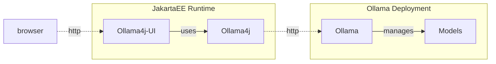

# Ollama4j-UI

This project should be seen as a showcase to create a java based frontend application (using the [Vaadin](https://vaadin.com/)-Framework on top of an [OpenLiberty](https://openliberty.io/) JakartaEE10 server) for model interaction against the [Ollama](https://ollama.ai) using the Java [ollama4j](https://github.com/amithkoujalgi/ollama4j) API. 

It should be considered a set of samples / use cases rather than a fully-functional interchained application serving each and every aspect of AI driven applications.

However one main goal of this repository is that anybody using java as their primary development language can create an environment to start Ollama development on a local server / local machine in only some minutes.

### Architecture



### Build Status


### Requirements

The following requirements must be met to run this application:


[![][ollama-shield]][ollama] **Or** [![][ollama-docker-shield]][ollama-docker]

[ollama]: https://ollama.ai/

[ollama-shield]: https://img.shields.io/badge/Ollama-Local_Installation-blue.svg?style=just-the-message&labelColor=gray

[ollama-docker]: https://hub.docker.com/r/ollama/ollama

[ollama-docker-shield]: https://img.shields.io/badge/Ollama-Docker-blue.svg?style=just-the-message&labelColor=gray


## Running the Application

Import the project to the IDE of your choosing as a Maven project. Configure the [microprofile-config.properties](src/main/resources/META-INF/microprofile-config.properties) to match your local requirements.

Run application using
```
mvn liberty:dev
```

Open [http://localhost:9080/ollama4j-ui](http://localhost:9080/ollama4j-ui) in browser.

Specify the model to use using the model-selector in the top right corner ot the application (should be defaulted to your default model set in microprofile-config.properties).

### Get Involved
Contributions are most welcome! Whether it's reporting a bug, proposing an enhancement, or helping with code - any sort of contribution is much appreciated.

### Credits
Shout out to [@amithkoujalgi](https://github.com/amithkoujalgi) for creating the awesome [ollama4j](https://github.com/amithkoujalgi/ollama4j/) library that inspired the creation of this application.

Further shoutout to everybody involved and active around the awesome [Ollama](https://ollama.ai/) project.

